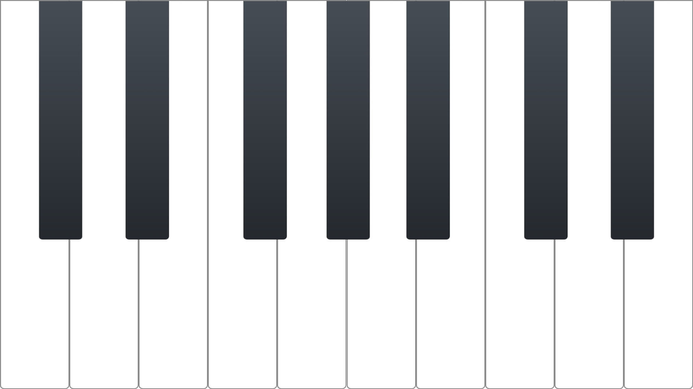

  
  <h1 align="center">Minimal Piano React</h1>

  
  
  
  
  

## Description
Minimal Piano React is is an free, open-source piano app without any ads or in-app purchases. It is built cross-platform to work on multiple devices.

## Screenshots

  
  &nbsp;&nbsp;
  

## Install
The new [refined version](https://github.com/mario-ruoff/minimal-piano-native) built in native android is available on Google Play.

## Features
- 🎉 Ad-free
- ⭐️ No premium purchases
- 🌹 Beautiful buttons
- 👇 Multitouch support
- 🔈 One simple piano sound
- ❤️️ Made with love

## TODOs
- Add moving piano pitch feature
- Add expanding/shrinking key amount feature

## Contribution
Contributions to Minimal Piano are welcome! If you find any issues or have suggestions for new features, please open an issue or submit a pull request. Make sure to follow the code style and guidelines.

## License
This project is licensed under the GNU General Public License v3.0 License. See the [LICENSE](LICENSE) file for more information.

## Contact
For questions, suggestions, or collaborations, feel free to contact the project maintainer:

Mario Ruoff

- GitHub: [@mario-ruoff](https://github.com/mario-ruoff)
- Email: [info@mario-ruoff.x10.mx](mailto:info@mario-ruoff.x10.mx)
